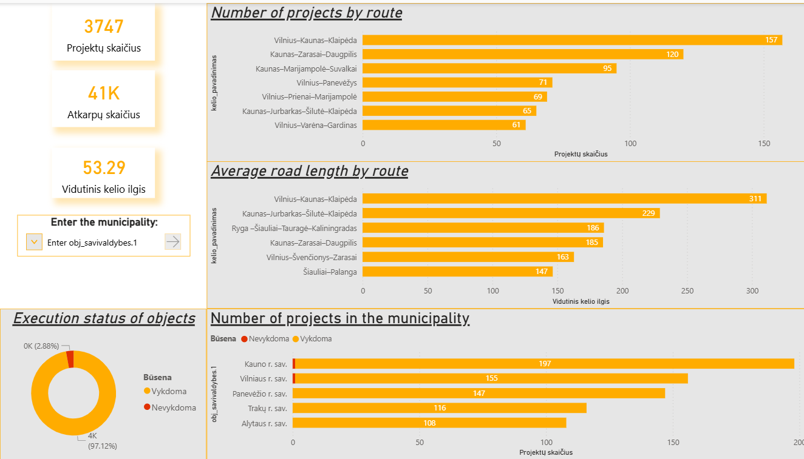
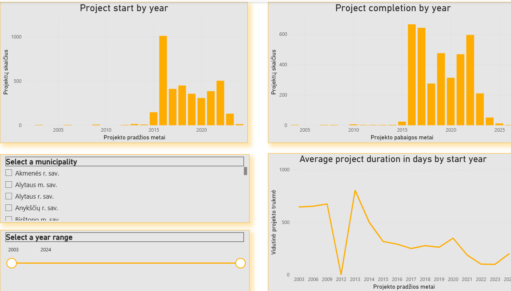
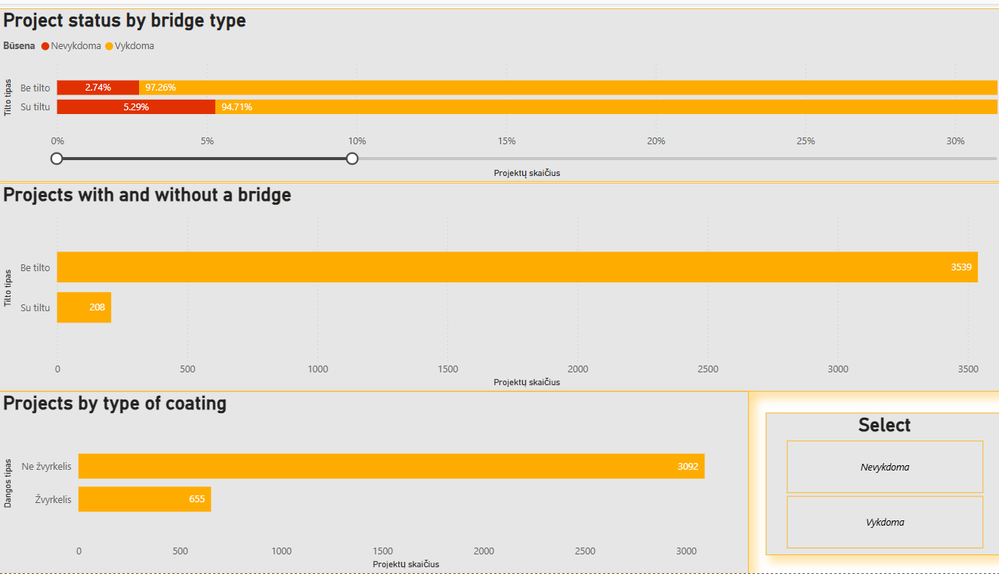

# Road Works Analysis | Power BI Project

This Power BI project focuses on the analysis of road works data.  
It highlights my ability to work with raw datasets, perform data cleaning and transformation in Power Query, and create clear, interactive dashboards for reporting and decision support.

## Overview

The purpose of this project was to transform unstructured raw data into a meaningful visual report that presents road works information in an accessible and professional format.

## Tools & Technologies

- Power BI
- Power Query
- GitHub

## Project Workflow

- Imported raw dataset into Power BI
- Cleaned and transformed data in Power Query
- Removed unnecessary, empty, and technical columns
- Corrected and standardized data types
- Built report visuals for key insights
- Improved dashboard usability with filters and visual interactions

## Analysis Focus

The report includes analysis of:
- number of recorded objects
- road work categories and types
- price distribution
- road sections and object titles
- summary and average indicators

## Repository Contents

- `Roads work project.pbix` – Power BI report file
- `README.md` – project documentation
- screenshot files for dashboard preview

## Skills Demonstrated

This project demonstrates:
- data cleaning and preparation
- Power Query transformations
- dashboard design in Power BI
- data storytelling through visuals
- project presentation on GitHub

## Preview
### Main Dashboard

### Analysis of Terms

### Object Analysis

